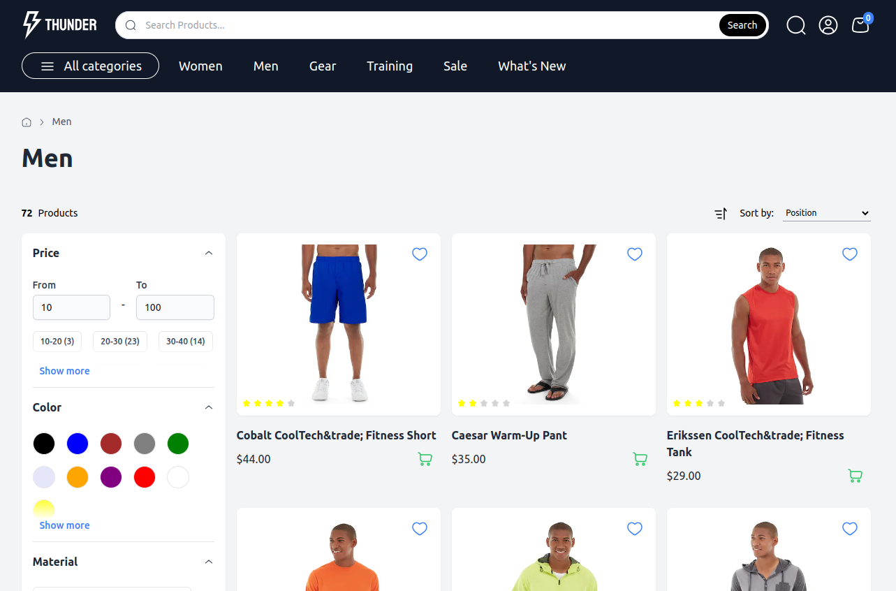

# Thunder

> **Note** This is the first iteration of this project. Is still under active development.

<div align="center">



</div>

## Introduction

Nuxt 3 e-commerce application. Implemented for the Magento 2 platform.


## Getting started

Node.js v20 and pnpm are required to run the project.

```sh
# Install dependencies
pnpm i

# Build packages
pnpm build

# Run project storefront demo
pnpm dev
```

## Architecture

Thunder Project was built as a framework divided into separate Nuxt layers, which are used in the demo storefront app.

**Types**

Common types for storefront and other layers. Created to unify project and smooth migration to other e-commerce frameworks.

**Magento Layer**

This layer provides an abstraction to Magento 2 API by providing composables functions.

**Composables Layer**

A set of composables like `useProductList` or `useCustomer` to use business logic and state in any Nuxt 3 project.

**Demo Apps**

Demo application to get started with Thunder based on Nuxt 3.

### Progress

| Feature                        | Ongoing Enhancements | Done | In Progress | In the Pipeline |
| ------------------------------ | -------------------- | ---- | ----------- | --------------- |
| Performance                    |                      |      | ✅          |                 |
| SEO                            | ✅                   |      |             |                 |
| Cart                           | ✅                   |      |             |                 |
| Search                         | ✅                   |      |             |                 |
| Shipping                       | ✅                   |      |             |                 |
| Checkout                       | ✅                   |      |             |                 |
| Listing                        | ✅                   |      |             |                 |
| Filtering                      | ✅                   |      |             |                 |
| Wishlists                      | ✅                   |      |             |                 |
| Account                        | ✅                   |      |             |                 |
| Coupons                        | ✅                   |      |             |                 |
| Product Reviews                | ✅                   |      |             |                 |
| Product Categories List        | ✅                   |      |             |                 |
| Mobile layout                  | ✅                   |      |             |                 |
| Cookie Popup & GDPR Compliance |                      |      |             | ✅              |
| Progressive Web App (PWA)      |                      |      |             | ✅              |
| Language Support (i18n)        | ✅                   |      |             |                 |
| CMS                            | ✅                   |      |             |                 |
| Dark Mode support              | ✅                   |      |             |                 |
| Magento Page Builder           |                      |      | ✅          |                 |
| Demo client application        |                      |      | ✅          |                 |
